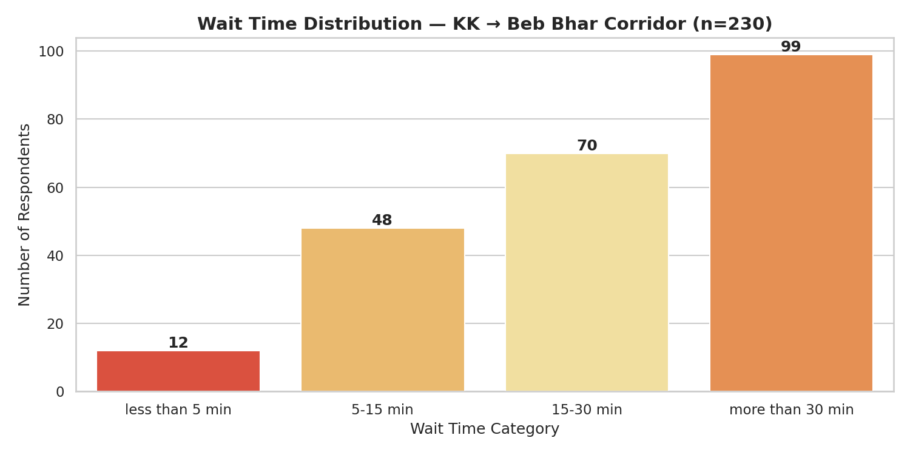
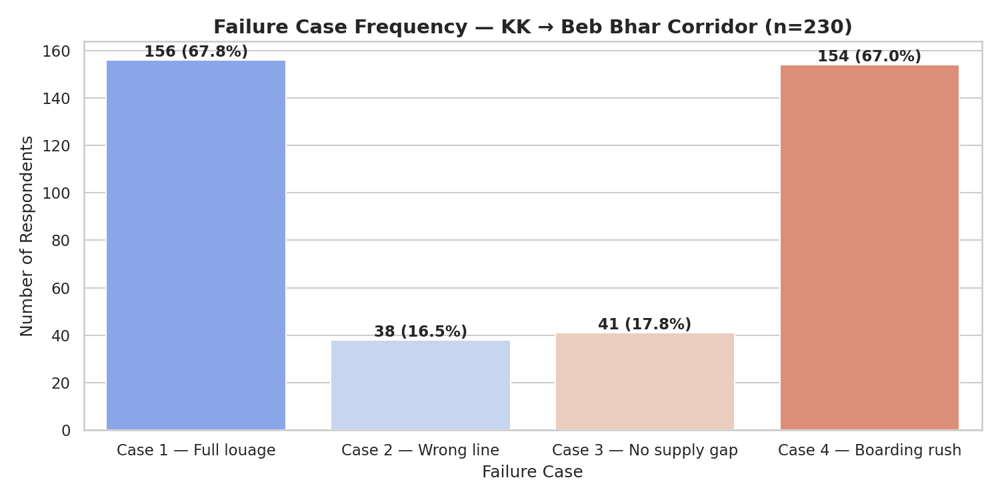
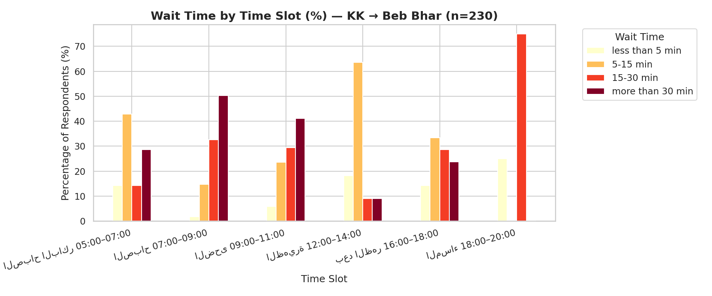
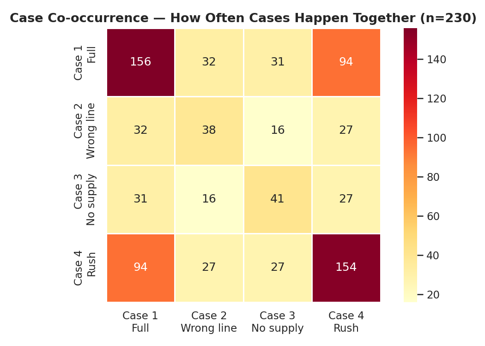
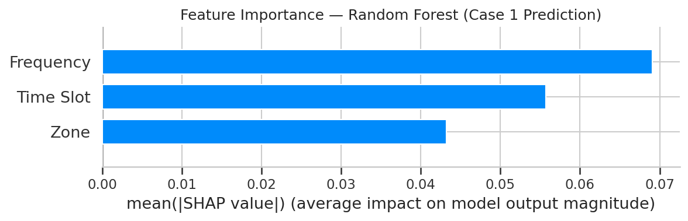
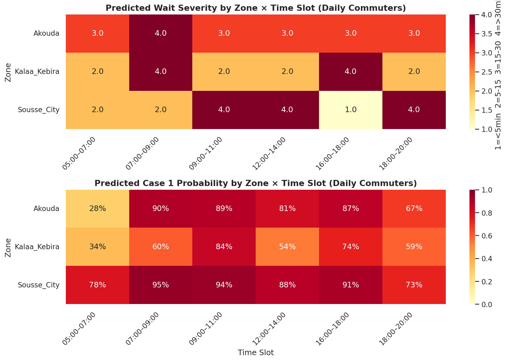
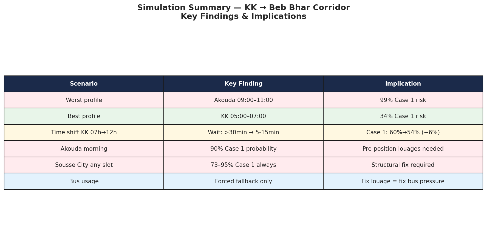

# mobility-in-sousse-research
# 🚐 Kalaa Kebira → Beb Bhar — Urban Mobility Study
### Predicting shared taxi demand and diagnosing service failures on Sousse's most-used informal transit corridor


## The Problem

The city of Sousse has a formal bus network, but chronic unreliability — irregular schedules, long gaps, and unpredictable service — has pushed the majority of daily commuters toward **shared taxis (louages)** as their primary means of transport.

On the **Kalaa Kebira → Beb Bhar corridor**, louages are the de facto public transit system. Yet they operate with no schedule, no coordination, and no data. The result: passengers can wait 5 minutes or 40 minutes with no way to know which it will be. During peak hours, when a louage finally arrives after a long gap, the rush of passengers means many are left behind and the wait resets.

This project studies that system — rigorously and from the ground up — to understand *why* waits are long, *when* they are worst, and *what interventions* would have the highest impact.

---

## Research Questions

1. At which zones and time slots is demand consistently outpacing supply?
2. Which of the four service failure types dominates — and does it vary by location and hour?
3. Can we predict wait severity and failure case type based on boarding zone, time slot, and travel frequency?
4. What is the measurable contribution of bus unreliability to louage overcrowding?
5. What low-cost interventions (scheduling coordination, physical infrastructure, signage) would close the gap?

---

## The Four Failure Cases

This project distinguishes four structurally different reasons a passenger waits:

| Case | Description | Root cause | Solution direction |
|------|-------------|------------|-------------------|
| **Case 1** | A louage passes but is already full | Demand exceeds total supply | More louages, or pre-positioning |
| **Case 2** | A louage passes but goes a different route (e.g. Sahloul) | Route confusion / mixed lines | Signage, route separation |
| **Case 3** | No louage passes at all for an extended period | Supply gap / irregular headway | Departure scheduling at origin |
| **Case 4** | A louage arrives but passenger is left behind due to rushing | No queue discipline, no boarding order | Physical queue markers, boarding protocol |

Each case has a different cause and a different fix. A model trained only on "wait time" cannot distinguish them. This project records each case separately, enabling multi-label failure classification.

---
## Current Findings 
# Phase 1 & 2

From **230 survey responses** collected from daily KK → Beb Bhar commuters:

- **67.8%** of respondents regularly experience Case 1 (full louages passing)
- **67.0%** experience Case 4 (boarding rush / left behind)
- **43%** experience both Case 1 and Case 4 simultaneously
- **73%** wait more than 15 minutes on average
- **43%** wait more than 30 minutes — the single largest category
- Morning slot (07:00–09:00) has the highest proportion of >30 min waits (50%)
- Midday (12:00–14:00) is the best service window (64% wait only 5-15 min)
- **87%** report Monday as the worst day
- **75%** rarely or never use the bus, confirming near-total louage dependency
- Most respondents board from **Kalaa Kebira zone** (175/230)

  ### Key Charts











> ⚠️ **ML finding :** Three classifiers trained on 229 responses 
> (Decision Tree, Random Forest, XGBoost) were evaluated on wait time 
> prediction (4-class) and Case 1 binary prediction. Random Forest and XGBoost 
> achieved 69.57% accuracy on Case 1 prediction vs 67.39% baseline — modest 
> but genuine signal. SHAP analysis identified **travel frequency** as the 
> strongest predictor, followed by time slot and boarding zone.
# Phase 4 — Simulation Results

- Worst predicted profile: **Akouda, 09:00–11:00** — 99% Case 1 risk
- Best predicted profile: **KK, 05:00–07:00** — 34% Case 1 risk  
- Time shift KK 07h→12h: wait drops from >30min to 5-15min, but Case 1 only drops 6%
- Sousse City faces 73–95% Case 1 risk at **every** time slot — structural fix required
- Bus usage confirmed as forced fallback, not modal preference





## Corridor Overview

```
Kalaa Kebira (depart)
      │
      ├── Akouda: El Warda · Gamooun ★
      │
      ├── Hammam Sousse: Rp. Meublatex · Sidi Salem ★ · Menchia
      │
      ├── Khzema · Station Panorama · Station Hospital
      │
Beb Bhar (arrival)
```

**Louage types at origin (Kalaa Kebira):**
- 🟡 **Yellow, no sign** → our line (KK → Beb Bhar), capacity **8 passengers**
- 🔵 **White with blue stripe** → KK → Akouda → Sahloul (overlaps at Akouda stops)
- 🟡 **Yellow, "Sahloul" sign** → KK → Sahloul direct (no stop overlap)
- ⬜ **Internal KK** → within Kalaa Kebira only (no overlap, ignored)

---

## Methodology

### Phase 1 — Passenger Survey
A bilingual (Arabic/French) Google Forms survey deployed to daily commuters 
on the KK → Beb Bhar corridor. Respondents reported their boarding station, 
destination, travel frequency, typical time slot, average wait time, and which 
of the four failure cases they regularly experience.

**Survey link:** https://docs.google.com/forms/d/e/1FAIpQLSc0XxDJODYXb2eao84x0sgewVG7ODLANQRoA_JOU_Jf57fG2w/viewform?usp=header
**Responses collected:** 230

### Phase 2 — Exploratory Data Analysis
Demand heatmaps by station × hour × day. Supply-demand gap analysis. Case frequency breakdown. Correlation with contextual variables.

### Phase 3 — Machine Learning Models

**Classification Targets:**

| Target | Type | Research Question |
|--------|------|------------------|
| `wait_time` | 4-class classification | Can we predict wait severity based on boarding zone, time slot, and travel frequency? |
| `case_full` | Binary classification | Can we predict whether a passenger will experience full louages passing (Case 1)? |
| `case_rush` | Binary classification | Can we predict whether a passenger will experience boarding rush exclusion (Case 4)? |

**Models (in order of complexity):**
- Decision Tree — interpretable baseline
- Random Forest — ensemble method, handles small datasets better
- XGBoost
**Features used:** boarding zone, time slot, travel frequency

**Evaluation metrics:** Accuracy, F1-score, Precision, Recall, Confusion Matrix

**Baseline:** majority-class classifier (always predict most frequent class)

### Phase 4 — Simulation & Scenario Testing
Use trained models to simulate interventions: what happens to unmet demand if departure intervals at KK are regularised to every 12 minutes during peak hours? Which stations benefit most from adding one additional louage?

### Phase 5 — Proposals & Deliverables
Data-backed recommendations for municipal authorities, an interactive demand dashboard, and a published academic-style report.

---

## Dataset Schema

| Column | Type | Description |
|--------|------|-------------|
| `station` | str | Boarding station reported by respondent |
| `destination` | str | Destination station |
| `frequency` | str | How often they use the line (daily / 3-5x / 1-2x per week) |
| `time_slot` | str | Usual travel time window |
| `wait_time` | str | Typical wait time (< 5 min / 5-15 / 15-30 / > 30 min) |
| `case` | str | Failure cases experienced (multi-select) |
| `case_full` | int | 1 if passenger experiences full louages (Case 1) |
| `case_wrongline` | int | 1 if wrong-line louages are a problem (Case 2) |
| `case_nogap` | int | 1 if long supply gaps occur (Case 3) |
| `case_rush` | int | 1 if boarding rush causes exclusion (Case 4) |
| `worst_day` | str | Day of week with worst waiting experience |
| `uses_bus` | str | Whether respondent uses the bus as alternative |
| `why_prefer_louage` | str | Reason for preferring louage over bus |
---

## Tech Stack

| Layer | Tools |
|-------|-------|
| Data collection | Google Forms (bilingual Arabic/French survey) |
| Data processing | Python · pandas · numpy |
| Visualisation | matplotlib · seaborn · plotly |
| Machine learning | scikit-learn · XGBoost · SHAP |
| Dashboard | Streamlit |
| Report | LaTeX / Overleaf |
| Version control | Git / GitHub |

---

## Project Status

- [x] Problem definition and research design
- [x] Corridor mapping and louage type classification
- [x] Bilingual survey deployed (Arabic/French)
- [x] 230 responses collected from daily commuters
- [x] Phase 2: Exploratory Data Analysis (6 charts)
- [x] Phase 3: ML pipeline — Decision Tree, Random Forest, XGBoost, SHAP
- [x] Phase 4: Simulation & scenario testing
- [ ] Phase 5: Dashboard and report
---

## Why This Matters

Informal transit systems like louages carry millions of daily passengers across North Africa and the Global South. They are fast, cheap, and demand-responsive — but opaque, uncoordinated, and unequal. This project is, to the author's knowledge, the first structured, ML-informed demand study on this specific corridor.

The outputs are designed to be immediately actionable: not a paper for a drawer, but evidence for a meeting with a city transport official.

---

## Author

**Mariem Belaid**  
Computer Science student, Sousse, Tunisia  
*survey design, data collection, modelling, and analysis — all conducted independently as a self-directed research project.*

---

## License

Data collected in this project is original survey data from 230 commuters 
on the KK → Beb Bhar corridor. Code is MIT licensed. 
Contact the author before reproducing findings.
